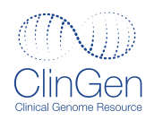

  
  &nbsp;&nbsp;&nbsp;&nbsp;
  

# ClinVar-GKS

ClinVar-GKS is a data transformation pipeline that converts [ClinVar](https://www.ncbi.nlm.nih.gov/clinvar/) release data into its [GA4GH GKS](https://www.ga4gh.org/genomic-knowledge-standards/) (Genomic Knowledge Standards) equivalent. It is developed and maintained by the [ClinGen](https://clinicalgenome.org/) driver project.

## What It Does

The pipeline processes the complete ClinVar XML release — over **2.8 million variations** and **4.1 million submitted classifications (SCVs)** — and transforms them into standardized GA4GH formats:

- **[VRS](https://vrs.ga4gh.org/)** (Variation Representation Specification) — normalized, computable variant identifiers
- **[Cat-VRS](https://cat-vrs.readthedocs.io/)** (Categorical VRS) — categorical variant representations (canonical alleles, copy number variants)
- **[VA-Spec](https://va-spec.readthedocs.io/)** (Variant Annotation Specification) — clinical variant classification statements

## Who It's For

- **Implementers** building tools that consume ClinVar data in GA4GH standard format
- **Researchers** who need programmatic access to normalized ClinVar classifications
- **GA4GH specification developers** using ClinVar-GKS as a real-world validation of GKS schemas

## How It Works

The pipeline runs on **Google BigQuery** using SQL stored procedures, with an external VRS Python processing step. It is designed for periodic batch processing, typically running weekly in sync with ClinVar releases.

See the [Pipeline Overview](pipeline/index.md) for the full workflow, or jump to [Getting Started](getting-started.md) to access the output datasets.

## Output Datasets

Each pipeline run produces three JSONL files distributed via Google Cloud Storage:

| File | Description |
| --- | --- |
| `variation` | Cat-VRS categorical variant representations for all ClinVar variations |
| `scv_by_ref` | VA-Spec SCV statements with variations referenced by ID |
| `scv_inline` | VA-Spec SCV statements with full variation objects inline |

See [Data Access](data-access/index.md) for download URLs and format details.

## License

- **Code** (SQL procedures, scripts): [MIT License](https://github.com/clingen-data-model/clinvar-gks/blob/main/LICENSE)
- **Data outputs**: [CC0 1.0 Universal](https://github.com/clingen-data-model/clinvar-gks/blob/main/LICENSE-DATA) (public domain)
