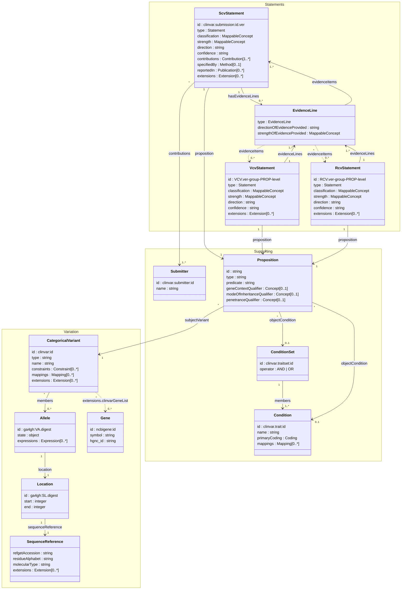

# Data Model

The ClinVar-GKS release file organizes data into bundle sections, each containing objects of a specific class. These classes form a directed graph of relationships — variants reference alleles, alleles reference locations, statements reference propositions, and so on.

This page provides a visual overview of how the classes relate to each other, with links to detailed documentation for each class.

---

## Class Relationship Diagram

The diagram below shows how the bundle classes relate to each other in a UML-style view. Each class shows its key attributes. Lines indicate reference relationships — navigable from the class with the arrow. Multiplicity is shown on each end.

**Reading the diagram:**

- **Solid lines** are primary associations — always present when the parent object exists
- **Dashed lines** are optional or conditional associations (e.g., gene list from extensions, VCV/RCV self-referencing through evidence lines)
- **Multiplicity** on each end indicates cardinality (e.g., `1` = exactly one, `0..*` = zero or more, `1..*` = one or more)
- **Labels** on lines show the field name or JSON pointer path used for the reference

---

## Variation Classes

These classes represent the variant and its genomic context. VRS types (SequenceReference, Location, Allele) use their upstream GA4GH schemas directly. ClinVar-specific profiles are documented under [Variations](variations.md).

| Class | Bundle Section | Key Pattern | Description |
| --- | --- | --- | --- |
| SequenceReference | `sequenceReference` | `SQ.{digest}` | Reference sequence with refget accession, molecule type, and assembly |
| Location | `location` | `ga4gh:SL.{digest}` | Position or range on a sequence reference |
| Allele | `allele` | `ga4gh:VA.{digest}` | Specific sequence change at a location |
| Gene | `gene` | `ncbigene:{id}` | Gene record with Entrez ID, HGNC ID, and symbol |
| [ClinvarCategoricalVariant](ClinvarCategoricalVariant.md) | `variation` | `clinvar:{id}` | ClinVar variation with Cat-VRS representation and extensions |

See [Variations](variations.md) for the full variant type hierarchy and extension documentation.

---

## Supporting Classes

These classes represent the conditions, submitters, and propositions that support classification statements. Conditions and submitters use upstream GA4GH types. ClinVar-specific proposition types are documented under [Propositions](propositions.md).

| Class | Bundle Section | Key Pattern | Description |
| --- | --- | --- | --- |
| Condition | `condition` | `clinvar.trait:{id}` | Disease or phenotype with MedGen coding and cross-references |
| ConditionSet | `conditionSet` | `clinvar.traitset:{id}` | Grouping of conditions with AND/OR membership operator |
| Submitter | `submitter` | `clinvar.submitter:{id}` | Submitting organization |
| [ClinvarProposition](ClinvarProposition.md) | `proposition` | `{scv_id}-{CODE}` | Classification proposition (12 types) |

See [Propositions](propositions.md) for the full type/code/predicate reference.

---

## Statement Classes

These classes represent classification statements at different levels of aggregation. All are profiles of the VA-Spec Statement type documented under [Statements](statements.md).

| Class | Bundle Section | Key Pattern | Description |
| --- | --- | --- | --- |
| [ClinvarScvStatement](ClinvarScvStatement.md) | `scv` | `clinvar.submission:{id}.{ver}` | Submitted classification |
| [ClinvarVcvStatement](ClinvarVcvStatement.md) | `vcv` | `{vcv}-{group}-{prop}-{level}` | Variant-level aggregate |
| [ClinvarRcvStatement](ClinvarRcvStatement.md) | `rcv` | `{rcv}-{group}-{prop}-{level}` | Condition-level aggregate |
| [ClinvarSomaticEvidenceLine](ClinvarSomaticEvidenceLine.md) | (nested) | — | Somatic clinical impact evidence line |

See [Statements](statements.md) for the aggregation structure and [Evidence Lines](evidence.md) for the somatic tier mapping.
