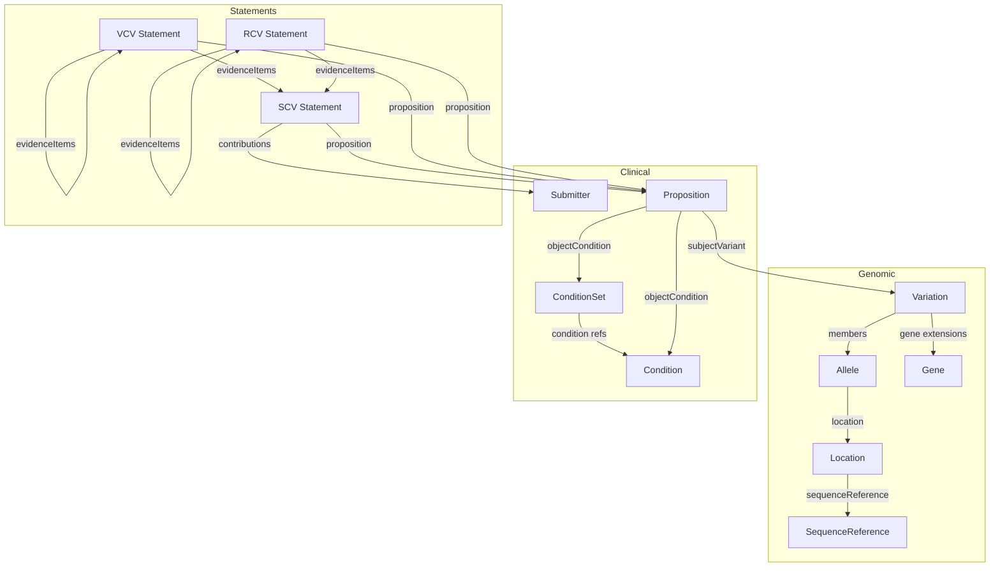

# Data Model

The ClinVar-GKS release file organizes data into bundle sections, each containing objects of a specific class. These classes form a directed graph of relationships — variants reference alleles, alleles reference locations, statements reference propositions, and so on.

This page provides a visual overview of how the classes relate to each other, with links to detailed documentation for each class.

---

## Class Relationship Diagram

The diagram below shows the major classes and their reference relationships. Arrows indicate which class references which — for example, a Variation references one or more Alleles via `#/allele/` pointers.

---

## Genomic Classes

These classes represent the variant and its genomic context.

### [SequenceReference](sequence-reference.md)

A reference sequence (chromosome, transcript, or protein) identified by its refget accession. Carries molecule type, residue alphabet, and assembly information.

**Bundle section:** `sequenceReference` — keyed by refget accession (e.g., `SQ.0iKlIQk2oZLoeOG9P1riRU6hvL5Ux8TV`)

### [Location](location.md)

A position or range on a sequence reference, identified by a VRS sequence location digest. References its parent sequence via `#/sequenceReference/`.

**Bundle section:** `location` — keyed by VRS location ID (e.g., `ga4gh:SL.Eg_6kV6Bb4FMjm9kEolHZ_4NhU8lBEsZ`)

### [Allele](allele.md)

A specific sequence change at a location, identified by a VRS allele digest. Carries the alternate state, expressions (SPDI, HGVS, gnomAD), and references its location via `#/location/`.

**Bundle section:** `allele` — keyed by VRS allele ID (e.g., `ga4gh:VA.ELQCnIBGqaTl0AEE0Az18XZ2cgIHAQIY`)

### [Gene](gene.md)

A gene record with NCBI Entrez gene ID, HGNC ID, symbol, and identifier IRIs. Referenced from variation extensions via `#/gene/`.

**Bundle section:** `gene` — keyed by `ncbigene:{gene_id}` (e.g., `ncbigene:3077`)

### [Variation](variation.md)

A ClinVar variation — the central entity linking a genomic change to its clinical classifications. Each variation carries cross-references, HGVS expressions, gene associations, and a set of constraints that define its relationship to a VRS allele or location.

ClinVar variations are represented using three GA4GH Cat-VRS recipes:

- **CanonicalAllele** — The vast majority of ClinVar variations. ClinVar identifies each variation by mapping submitted variant attributes to a GRCh38 genomic allele (falling back to GRCh37 or NCBI36 for historical data). This *defining allele* becomes the `DefiningAlleleConstraint`, and the same genomic allele is used to generate the VRS representation referenced via `#/allele/`.

- **CategoricalCnvCount / CategoricalCnvChange** — Copy number variants use a `DefiningLocationConstraint` following the same identification approach, with an additional `CopyCountConstraint` when ClinVar provides an absolute copy count, or a `CopyChangeConstraint` when only gain/loss is indicated.

- **Generalized Categorical Variant** — Haplotypes, genotypes, and other complex or ambiguously defined variants that cannot yet be mapped to a specific VRS allele or location. These rely solely on the ClinVar variation ID to distinguish them. Work continues within the GA4GH GKS workstream to expand VRS and Cat-VRS coverage for these types as community need arises.

**Bundle section:** `variation` — keyed by `clinvar:{variation_id}` (e.g., `clinvar:10`)

---

## Clinical Classes

These classes represent the conditions, submitters, and propositions that support clinical classification statements.

### [Condition](condition.md)

A disease or phenotype concept from ClinVar's trait data, with MedGen primary coding and cross-references to OMIM, MONDO, HPO, Orphanet, and MeSH.

**Bundle section:** `condition` — keyed by `clinvar.trait:{trait_id}` (e.g., `clinvar.trait:9580`)

### [ConditionSet](condition-set.md)

A grouping of multiple conditions with a membership operator (AND or OR) and references to member conditions via `#/condition/`.

**Bundle section:** `conditionSet` — keyed by `clinvar.traitset:{trait_set_id}` (e.g., `clinvar.traitset:1234`)

### [Submitter](submitter.md)

A submitting organization identified by ClinVar submitter ID, with name and type.

**Bundle section:** `submitter` — keyed by `clinvar.submitter:{submitter_id}` (e.g., `clinvar.submitter:500139`)

### [Proposition](proposition.md)

A classification proposition defining what a statement asserts — the proposition type, predicate, subject variant (via `#/variation/`), and object condition (via `#/condition/` or `#/conditionSet/`). May also include gene context, mode of inheritance, and penetrance qualifiers.

**Bundle section:** `proposition` — keyed by proposition ID (e.g., `SCV001234567-PATH`, `VCV000012582.63-G-PATH-CP`)

---

## Statement Classes

These classes represent the clinical classification statements at different levels of aggregation.

### [SCV Statement](scv-statement.md)

A submitted clinical classification (SCV) — the atomic unit of ClinVar data. Each SCV carries a classification, strength, direction, proposition reference, contributions with submitter references, evidence lines, citations, assertion method, and extensions with submitted condition provenance.

**Bundle section:** `scv` — keyed by `clinvar.submission:{scv_id}.{version}` (e.g., `clinvar.submission:SCV001234567.1`)

### [VCV Statement](vcv-statement.md)

A variation-level aggregate classification (VCV) — aggregates SCVs across a variation by classification grouping, priority (somatic tiers), and submission level contribution. Evidence lines reference contributing SCVs or lower-level VCV groupings.

**Bundle section:** `vcv` — keyed by the VCV layer ID (e.g., `VCV000012582.63-G-PATH-CP`)

### [RCV Statement](rcv-statement.md)

A condition-level aggregate classification (RCV) — follows the same aggregation structure as VCVs but scoped to a specific RCV accession (variation + condition combination).

**Bundle section:** `rcv` — keyed by the RCV layer ID (e.g., `RCV000012345.8-G-PATH-CP`)
